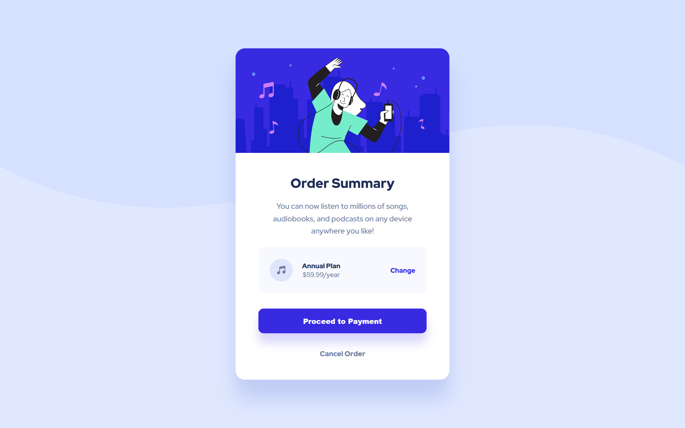

# Frontend Mentor - Order summary card solution

This is a solution to the 
[Order summary card challenge on Frontend Mentor](https://www.frontendmentor.io/challenges/order-summary-component-QlPmajDUj).

## Table of contents

- [Overview](#overview)
  - [Screenshot](#screenshot)
  - [Links](#links)
- [My process](#my-process)
  - [Built with](#built-with)
  - [What I learned](#what-i-learned)
  - [Continued development](#continued-development)
  - [Useful resources](#useful-resources)
- [Author](#author)
- [Acknowledgments](#acknowledgments)

## Overview

### Screenshot
Original Design:

My Solution:

### Links

- Live Site URL: [Order Summary Component](https://ivaberiashvili.github.io/skilled-elearning-landing-page)

## My process

My process improved drastically with this project. It took me almost 3 times less than my previous and less complex project.
I believe it came down to systematic approach that saved me lots of time.
- I started bringing in the main elements, images and text.
- then I created the shapes and defined the correct spacing using margin and padding and positioned elements with flexbox
- finally adding button functionality 

### Built with

- Semantic HTML5 markup
- CSS custom properties
- Flexbox

### What I learned

- I learned **background-image** property which I'm sure will be my go-to solution for the next projects.

### Continued development

My [next project](https://github.com/ivaberiashvili/skilled-elearning-landing-page) will be much more complex, which will allow me to test my flexbox knowledge and elements' hierarchy.

### Useful resources

- [Mdn Web Docs > CSS ](https://developer.mozilla.org/en-US/docs/Web/CSS/) - This is extremely helpful with real time examples.

## Author

- [Iva](https://github.com/ivaberiashvili)